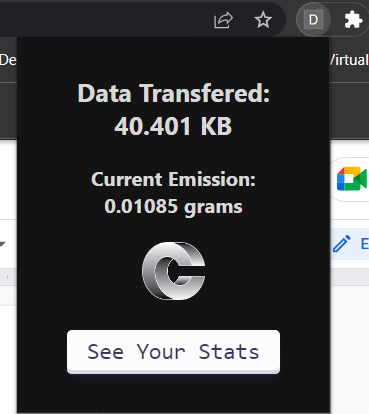

#  TRINIT_594092-U6BRG487_DEV
    
# **CarbonEyes**

Video demonstration can be found [here](https://drive.google.com/file/d/1N4sDaqi0SSdcY0UGafsXf2HUmv0BDQWN/view?usp=sharing).

A Chrome Extension which calculates total Carbon Emission using data transferred from various websites visited using **local storage**.

It consists of a popup for quick values and an extended website with detailed information about which websites have emitted the most to least amount of carbon.

### **How to Use**

- Download all the files from the repository to your local storage
- Go to Chrome Browser and click on Manage Extension
- Switch on developer mode and then click on “Load Unpacked” and select the github files

### **Popup**

Shows the Data Transferred for the current website and also the emission caused by the current website

To get Additional Information about the emission caused by the user. Click on “See Your Stats”

### **Webpage**

It consists of the **all time total** Co2 Emission by the user until he/she decides to use the “Clear History” button 

There are 2 graphs on the webpage. The Live line chart shows the change in emission vs time whereas the live donut graph shows the percentage of Co2 Emitted by each domain.

Also there is a feature to expand different domains and see which domain specific sessions cost more carbon emission.

The domains can also be ranked on the basis of “Emission” to see most to least contribution towards carbon footprint.

The Extended Website also shows which domain is Green, Semi Green and Not Green depending on the **average** of total carbon emission from a domain by the number of sessions ( in this case tabs ) contributing to the specific domain.

